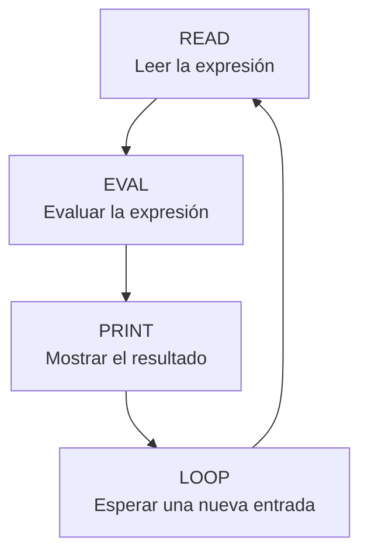
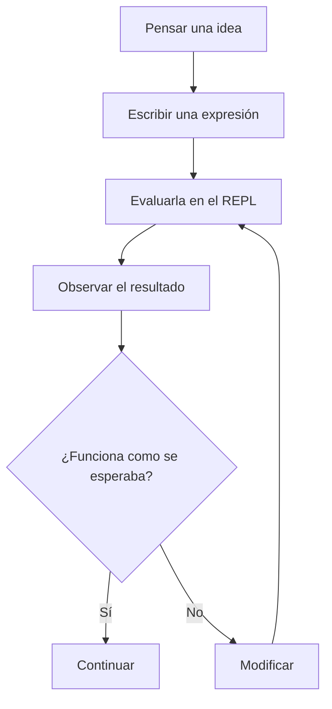

# Primeros pasos en Clojure y la programación dirigida por REPL

## Introducción

Clojure es un lenguaje de programación de propósito general perteneciente a la familia de Lisp. Fue creado por Rich Hickey y presentado públicamente en 2007. Su implementación principal se ejecuta sobre la **Máquina Virtual de Java (JVM)**, lo que permite utilizar bibliotecas y herramientas del ecosistema Java mientras se trabaja con características propias de la programación funcional [1], [2].

Entre las ideas principales de Clojure se encuentran el uso de funciones, la transformación de datos y la preferencia por estructuras de datos inmutables. Su sintaxis también es diferente a la de lenguajes como Java, Python o C++, ya que utiliza expresiones escritas principalmente entre paréntesis.

Una herramienta especialmente importante para comenzar a trabajar con este lenguaje es el **REPL**, cuyas siglas significan *Read-Eval-Print Loop*. Este entorno permite escribir una expresión, evaluarla y observar inmediatamente el resultado. De esta manera, el programador puede experimentar con el lenguaje sin necesidad de desarrollar primero un programa completo [3].

El objetivo de esta investigación es presentar los conceptos básicos para tener un primer acercamiento a Clojure y explicar cómo el uso del REPL puede formar parte tanto del aprendizaje como del proceso de desarrollo.

---

## Desarrollo técnico

### 1. ¿Qué es Clojure?

Clojure es un lenguaje de programación con un enfoque principalmente funcional. Esto significa que las funciones tienen un papel central y que se busca trabajar con transformaciones de datos en lugar de modificar constantemente un mismo estado.

Una característica importante es que Clojure se ejecuta principalmente sobre la **JVM**. Gracias a esto puede interactuar con clases y bibliotecas desarrolladas para Java, por lo que no funciona como un entorno completamente separado de esta plataforma [2].

Algunas de sus características principales son:

| Característica | Descripción |
| --- | --- |
| **Programación funcional** | Favorece el uso de funciones y la transformación de datos. |
| **Inmutabilidad** | Sus colecciones principales no se modifican directamente. |
| **Ejecución sobre la JVM** | Puede utilizar bibliotecas y clases del ecosistema Java. |
| **Tipado dinámico** | No es necesario declarar explícitamente el tipo de cada valor. |
| **Sintaxis Lisp** | Utiliza expresiones basadas principalmente en paréntesis. |
| **REPL** | Permite trabajar de forma interactiva durante el aprendizaje y desarrollo. |

#### Inmutabilidad

Una de las características más representativas de Clojure es la inmutabilidad de sus principales estructuras de datos. Esto significa que una operación genera un nuevo valor en lugar de modificar directamente el que ya existe.

Por ejemplo:

```clojure
(def numeros [1 2 3])

(conj numeros 4)
```

El resultado de `conj` es:

```text
[1 2 3 4]
```

Sin embargo, si se consulta nuevamente `numeros`:

```clojure
numeros
```

se obtiene:

```text
[1 2 3]
```

El vector original permanece igual. La operación creó una nueva colección con el elemento agregado.

---

### 2. Primer contacto con la sintaxis de Clojure

Una de las primeras diferencias que se observan en Clojure es el uso de **notación prefija**. En lugar de colocar un operador entre dos valores, primero se escribe la función u operador y después sus argumentos.

Por ejemplo, una suma que normalmente podría escribirse como:

```text
5 + 3
```

en Clojure se representa así:

```clojure
(+ 5 3)
```

El resultado es:

```text
8
```

El mismo principio se utiliza con otras operaciones:

```clojure
(- 10 4)
(* 6 5)
(/ 20 4)
```

Esta sintaxis puede parecer poco familiar al principio, pero mantiene una estructura consistente: primero se indica qué operación se realizará y después se proporcionan los valores que utilizará.

#### Definición de valores y funciones

Para asociar un nombre con un valor se puede utilizar `def`:

```clojure
(def nombre "Irene")
```

Después, el valor puede utilizarse en otras expresiones:

```clojure
(str "Hola, " nombre)
```

Resultado:

```text
"Hola, Irene"
```

Para definir una función con nombre se utiliza `defn`. Por ejemplo:

```clojure
(defn cuadrado [x]
  (* x x))
```

La función puede utilizarse de la siguiente manera:

```clojure
(cuadrado 6)
```

Resultado:

```text
36
```

En esta definición, `cuadrado` es el nombre de la función, `[x]` representa el parámetro y `(* x x)` es la expresión que produce el resultado.

#### Estructuras de datos básicas

Clojure incluye diferentes estructuras de datos. Entre las principales se encuentran las listas, vectores, mapas y conjuntos [4].

| Estructura | Ejemplo |
| --- | --- |
| Lista | `'(1 2 3)` |
| Vector | `[1 2 3]` |
| Mapa | `{:nombre "Ana" :edad 20}` |
| Conjunto | `#{1 2 3}` |

Los mapas permiten guardar información mediante pares de clave y valor. Por ejemplo:

```clojure
(def estudiante
  {:nombre "Irene"
   :carrera "Ingeniería en Sistemas Computacionales"})
```

Para consultar el nombre se puede utilizar:

```clojure
(:nombre estudiante)
```

Resultado:

```text
"Irene"
```

Con estas expresiones básicas ya es posible comenzar a experimentar con Clojure sin tener que desarrollar todavía un programa completo.

---

### 3. ¿Qué es un REPL?

REPL significa **Read-Eval-Print Loop**, que puede traducirse como ciclo de **lectura, evaluación, impresión y repetición** [3].

Su funcionamiento se divide en cuatro etapas:

1. **Read:** lee la expresión introducida por el programador.
2. **Eval:** evalúa la expresión.
3. **Print:** muestra el resultado.
4. **Loop:** regresa al inicio y espera una nueva expresión.

El proceso puede representarse de la siguiente manera:



En una sesión de Clojure puede aparecer un indicador como:

```text
user=>
```

Esto significa que el REPL está esperando una expresión.

Por ejemplo:

```clojure
user=> (+ 5 3)
8
```

Después puede definirse una función:

```clojure
user=> (defn cuadrado [x]
         (* x x))
#'user/cuadrado
```

y probarla inmediatamente:

```clojure
user=> (cuadrado 6)
36
```

Este pequeño ejemplo muestra la idea principal del REPL. Primero se introduce una expresión, después se obtiene su resultado y finalmente el entorno queda listo para recibir otra instrucción.

Aunque el REPL funciona de manera interactiva, esto no significa que Clojure sea únicamente un lenguaje interpretado. Su implementación principal trabaja sobre la JVM y las expresiones son procesadas para poder ejecutarse en esta plataforma [5].

---

### 4. Programación dirigida por REPL

La **programación dirigida por REPL** consiste en utilizar este entorno interactivo como parte habitual del desarrollo.

En lugar de escribir una gran cantidad de código antes de comprobar su funcionamiento, el programador puede trabajar con pequeñas expresiones o funciones y evaluarlas mientras construye la solución.

El proceso de trabajo dirigido por REPL puede representarse de la siguiente manera:



Este tipo de trabajo permite que el desarrollo sea más gradual. Si una función no produce el resultado esperado, puede modificarse y probarse nuevamente antes de continuar con otras partes del programa.

#### Comparación con un flujo tradicional

| Aspecto | Flujo tradicional | Flujo dirigido por REPL |
| --- | --- | --- |
| Desarrollo | Se pueden escribir varias partes antes de ejecutar | Se trabaja con pequeñas expresiones o funciones |
| Retroalimentación | Se obtiene después de ejecutar | Se obtiene inmediatamente |
| Corrección | Puede realizarse después de una ejecución completa | Puede hacerse durante el desarrollo |
| Exploración | Se consulta documentación y después se prueba | Es posible experimentar directamente |
| Estado del entorno | Puede reiniciarse con frecuencia | La sesión puede mantenerse activa |

La principal diferencia es el tiempo que pasa entre escribir una idea y comprobar su resultado.

#### Ventajas

Una de las principales ventajas es la **retroalimentación inmediata**. Esto facilita comprobar si una expresión funciona como se esperaba.

También puede ser útil para aprender Clojure, ya que permite experimentar con diferentes valores y observar directamente los resultados.

Otra ventaja es que ayuda a desarrollar funciones pequeñas y probarlas antes de combinarlas con otras partes del programa.

#### Limitaciones

El REPL también tiene algunas limitaciones. Una función creada únicamente dentro de una sesión puede perderse si no se guarda posteriormente en un archivo fuente.

También puede ocurrir que durante una sesión se redefina varias veces una función y el programador termine trabajando con una versión diferente a la almacenada en el proyecto.

Además, obtener un resultado correcto en el REPL no significa que el código haya sido probado en todos los casos posibles. Por esta razón, el REPL no sustituye las pruebas automatizadas, la documentación ni la organización correcta del código.

Su utilidad se encuentra principalmente en complementar estas prácticas con un entorno interactivo de experimentación.

---

## Conclusiones

Clojure es un lenguaje que ofrece una forma diferente de trabajar en comparación con muchos lenguajes imperativos. Su enfoque funcional, la inmutabilidad de sus estructuras de datos y su sintaxis basada en expresiones son algunos de los conceptos principales que deben comprenderse durante un primer acercamiento.

Al inicio, la notación prefija y el uso constante de paréntesis pueden parecer poco familiares. Sin embargo, los ejemplos básicos permiten observar que las expresiones mantienen una estructura consistente.

El REPL facilita especialmente el aprendizaje porque permite introducir expresiones sencillas y comprobar inmediatamente el resultado. Esto ayuda a experimentar con el lenguaje antes de desarrollar programas más grandes.

La programación dirigida por REPL lleva esta interacción al proceso de desarrollo. En lugar de esperar hasta terminar una sección completa del programa, se pueden construir y comprobar pequeñas partes de forma gradual.

Sin embargo, el REPL debe utilizarse como una herramienta complementaria. Las funciones que formarán parte de un proyecto deben almacenarse en archivos fuente y las pruebas realizadas de manera interactiva no sustituyen las pruebas formales.

Después de realizar esta investigación se puede concluir que el REPL es una de las herramientas más útiles para tener un primer acercamiento a Clojure, ya que permite aprender su sintaxis y sus conceptos mediante la experimentación directa. Además, muestra una forma de desarrollo basada en la interacción constante entre el programador y el código.

---

## Bibliografía

[1] R. Hickey, “A History of Clojure,” *Proceedings of the ACM on Programming Languages*, vol. 4, HOPL, Art. no. 71, pp. 1–46, Jun. 2020. [En línea]. Disponible en: https://doi.org/10.1145/3386321. [Consultado: 15-sep-2026].

[2] Clojure, “Clojure - Rationale,” *Clojure Documentation*. [En línea]. Disponible en: https://clojure.org/about/rationale. [Consultado: 15-sep-2026].

[3] Clojure, “Programming at the REPL: Introduction,” *Clojure Documentation*. [En línea]. Disponible en: https://clojure.org/guides/repl/introduction. [Consultado: 15-sep-2026].

[4] Clojure, “The Reader,” *Clojure Reference*. [En línea]. Disponible en: https://clojure.org/reference/reader. [Consultado: 15-sep-2026].

[5] Clojure, “Evaluation,” *Clojure Reference*. [En línea]. Disponible en: https://clojure.org/reference/evaluation. [Consultado: 15-sep-2026].
